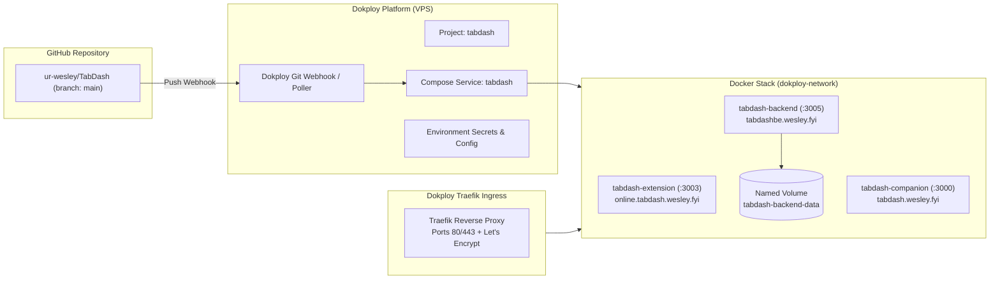

# Specification: Docker & Dokploy Automated Deployment for TabDash

## 1. Context & Motivation

Currently, TabDash deploys via a GitHub Actions workflow (`.github/workflows/deploy.yml`) that opens an SSH connection into a VPS, runs `git pull`, and invokes `docker compose up -d --build --force-recreate` using GitHub secrets.

This approach has significant issues:

1. **Security & Brittle SSH**: Plaintext sudo passwords and SSH secrets in GitHub Actions.
2. **Traefik Misconfiguration**:
   - `docker-compose.yml` connects to external network `traefik_default`, while Dokploy's Traefik runs on `dokploy-network`.
   - Router naming conflict: `tabdash-backend` accidentally uses `tabdashcompanion` router name.
   - ACME cert resolver is set to `le`, whereas Dokploy uses `letsencrypt`.
   - No explicit loadbalancer service ports configured.
3. **Data Loss**: No persistent volume is defined for `tabdash-backend`'s database at `DB_PATH=/opt/TabDash-data`.
4. **Outdated Dockerfiles**:
   - `companion/Dockerfile` uses EOL `node:19`.
   - `backend/Dockerfile` has syntax bugs (`ENV DB_PATH DB_PATH`).
   - `extension/Dockerfile` uses `vite preview` rather than an optimized production server.
5. **Goal**: Remove GitHub Actions deployment entirely and migrate to native Dokploy Docker Compose deployment with automated Git push webhooks.

## 2. Architecture & Design

## 3. Scope of Changes

### A. Remove GitHub Action

- Delete `.github/workflows/deploy.yml`.

### B. Modernize Docker Compose (`docker-compose.yml`)

- Update network to `dokploy-network` (`external: true`).
- Fix `tabdash-backend` router name from `tabdashcompanion` to `tabdashbackend`.
- Update TLS certresolver label to `letsencrypt`.
- Add explicit loadbalancer service ports:
  - `tabdash-extension`: 3003
  - `tabdash-companion`: 3000
  - `tabdash-backend`: 3005
- Add named volume `tabdash-backend-data` mounted at `/opt/TabDash-data`.
- Pass all build arguments for `tabdash-extension` (`VITE_OPENWEATHER_API_KEY`, `VITE_UNSPLASH_API_KEY`, `VITE_COMPANION_BASE`, `VITE_BACKEND_BASE`, `VITE_IS_EXTENSION`).

### C. Optimize Dockerfiles

- `backend/Dockerfile`:
  - Upgrade base to `node:20-alpine` (or `oven/bun:1-alpine`).
  - Fix `ENV DB_PATH=$DB_PATH` and `ENV PORT=$PORT` (or omit and rely on runtime env).
- `companion/Dockerfile`:
  - Multi-stage build with `node:20-alpine` builder and lightweight `nginx:alpine` runtime on port 3000 (or minimal preview server).
- `extension/Dockerfile`:
  - Multi-stage build with `node:20-alpine` builder and `nginx:alpine` runtime on port 3003 with SPA fallback routing.

### D. Dokploy Service Provisioning (via Dokploy MCP)

- Create Dokploy Project: `tabdash`.
- Create Compose service in Dokploy connected to GitHub `ur-wesley/TabDash`, branch `main`.
- Configure `autoDeploy: true`.
- Set environment variables (`WEATHER_API_KEY`, `UNSPLASH_API_KEY`, `VITE_COMPANION_BASE`, etc.) securely inside Dokploy.

## 4. Verification Gate

- `docker compose config` validation.
- Local multi-container build verification: `docker compose build`.
- Verification of Dokploy project & compose service creation via Dokploy MCP.
- Trigger test deployment in Dokploy and verify container health and logs.
