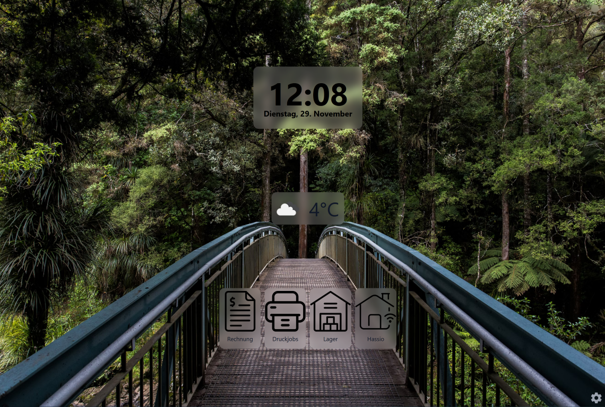
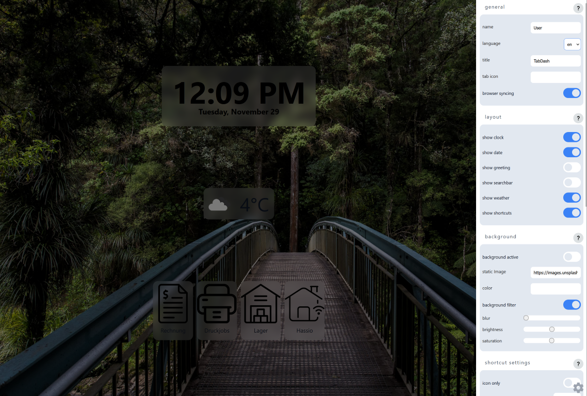

# TabDash

an open source, [Bonjourr](https://github.com/victrme/Bonjourr) inspired browser extension.

## Features

tbd

## Repo Overview

- `extension` where the extension source lives
- `companion` where the landing page with documentation lives

## Development

clone the repository and execute `pnpm install`

## Roadmap

- [x] 0.1: initial release
- [x] 0.2: bug fixes and new state management 
- [ ] 0.3: widget config (bg on/off, text color, text shadow)
- [ ] 0.4: weather improvements (custom location, better temperature rounding)
- [ ] 0.5: 
- [ ] 0.6: mobile optimization
- [ ] 1.0: first stable release
