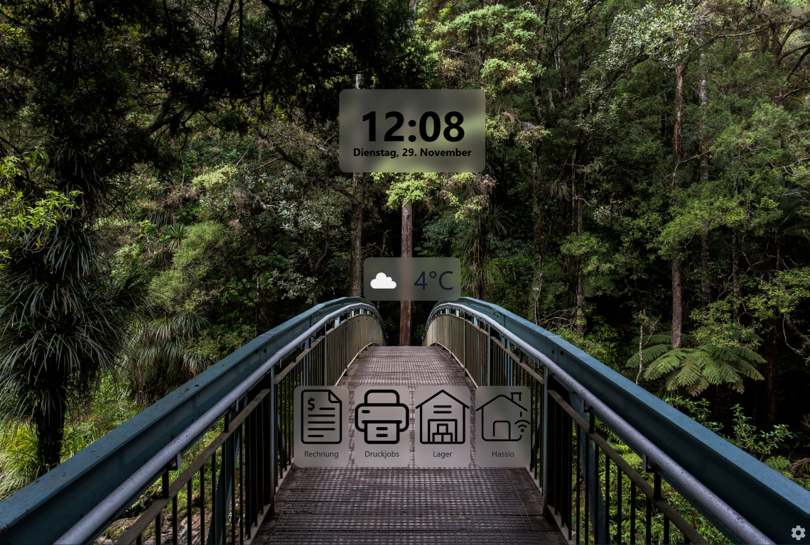
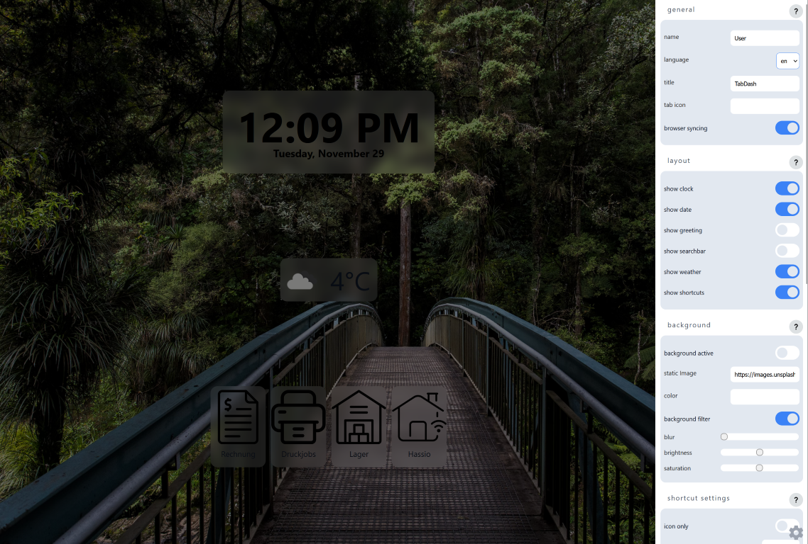

# TabDash

[Documentation](https://tabdash.wesley.fyi) | [Firefox Add-on](https://addons.mozilla.org/de/firefox/addon/tabdash/) | [Web Preview](https://online.tabdash.wesley.fyi)

<a href="https://addons.mozilla.org/de/firefox/addon/tabdash/"></a>
<a href="https://online.tabdash.wesley.fyi"></a>

An open-source, modern browser extension that transforms your new tab page into a clean, customizable dashboard.





---

## Features

- **Wallpapers**: Dynamic high-resolution wallpapers via Unsplash with intelligent pre-caching and author credits.
- **Clock & Date**: Fully localized time and date displays with optional seconds and custom formatting.
- **Weather Widget**: Current conditions and temperature via OpenWeather supporting metric and imperial units.
- **Quick Shortcuts**: Bookmark management with small, medium, large, and text-only layout options.
- **Multi-Engine Search**: Instant search bar with support for Google, DuckDuckGo, Bing, and Ecosia.
- **Accessible UI**: Modern controls powered by [@kobalte/core](https://kobalte.dev/) primitives (Switch, Slider, Tabs, Select, Button).
- **Encrypted Sync**: Optional settings sync with client-side encryption via Nitro & Unstorage backend.
- **Privacy First**: Zero tracking, zero telemetry cookies, and strict CSP.

---

## Workspaces Architecture

This project is structured as a Bun monorepo:

| Workspace                  | Description                                          | Stack                                       |
| :------------------------- | :--------------------------------------------------- | :------------------------------------------ |
| [`extension/`](extension/) | WebExtension (Manifest V3 for Chrome, Firefox, Edge) | SolidJS, Vite, UnoCSS, Kobalte, Nano Stores |
| [`companion/`](companion/) | Landing site and documentation                       | Astro, SolidJS, UnoCSS, Sass                |
| [`backend/`](backend/)     | Cloud settings sync API and install telemetry        | Nitro, Unstorage, Node.js / Bun             |

---

## Toolchain & Requirements

- **Runtime & Package Manager**: [Bun](https://bun.sh/) 1.4+
- **Linter**: [Oxlint](https://oxc.rs/) (type-aware fast linter)
- **Formatter**: [Oxfmt](https://oxc.rs/) (Oxc formatter)
- **Git Hooks**: [Lefthook](https://github.com/evilmartians/lefthook)
- **Task & Issue Tracking**: [Beads](https://github.com/gastownhall/beads) (`bd`)

---

## Getting Started

### Installation

```bash
bun install
```

### Development

```bash
# Start extension dev server
bun run dev:extension

# Start companion documentation site
bun run dev:companion

# Start backend server
bun run dev:backend
```

### Testing & Quality Checks

```bash
# Run unit tests across all workspaces
bun test

# Run linter and formatting checks
bun run check

# Auto-format all code
bun run fmt

# Build all workspaces for production
bun run build
```

---

## Issue Tracking with Beads

This project uses **Beads (`bd`)** for persistent task tracking backed by embedded Dolt:

```bash
bd ready              # List tasks ready for execution
bd show <id>          # View issue details
bd update <id> --claim  # Claim a task
bd close <id>         # Mark a task complete
```

---

## License

[MIT](LICENSE.md)
